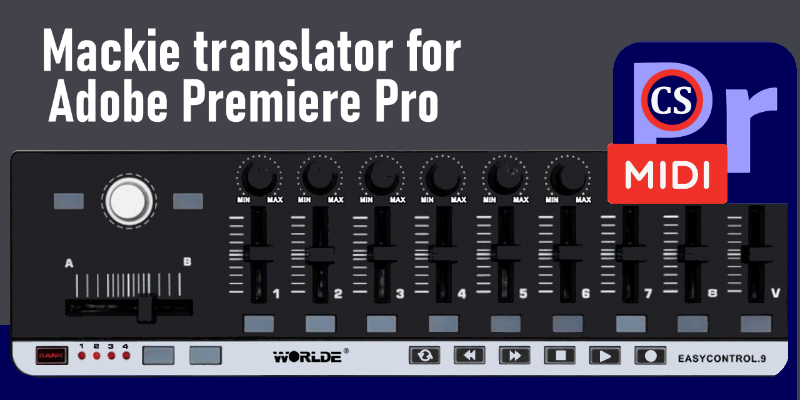

# MIDI EasyControl 9 - MIDI-MT is High Level Application Driver for USB MIDI Control Surface

MIDI-MT support x64/x86 Windows 10,11 and any Control Surfaces as __WORDLE__, __Pyle Audio PMIDIPD30__, __Fegoo__ manufacture and other.  

  

# MIDI-MT features

* Mackie translator for Adobe Premiere Pro
* Mixer of audio sessions of running applications
* Smart House controls

#### Mackie translator for Adobe Premiere Pro

EasyControl-MIDI to MIDI-Mackie Command Translator for Using the __MIDI keyboard__ in Adobe Premiere Pro.  
You can connect your __MIDI keyboard__ to Adobe Premiere Pro. The connection process is described in detail in the [wiki](https://github.com/ClaudiaCoord/MIDI-EasyControl-to-Mackie-translator-for-Premiere-Pro/wiki/EN-Settings-Premiere-Pro).

    
 Working with Adobe Premiere Pro 

    Setting up «Premiere Pro» comes down to selecting a MIDI controller from the «Control Surface» submenu in the «Setup» menu.
    You will only have to assign actions to the functions attached to the controller buttons.

#### Mixer of audio sessions of running applications

Additionally, it is possible to manage __audio sessions__ of running applications.  
Especially relevant, using the [built-in mixer](https://github.com/ClaudiaCoord/MIDI-EasyControl-to-Mackie-translator-for-Premiere-Pro/wiki/EN-Mixer) to control sound in __Windows 11__ , where the usual sound controls have been removed, and access to existing ones is associated with a long journey through the settings menu.  

    
 Applications audio sessions 

    Control can occur both from a MIDI keyboard and from the built-in sound control panel. 
    To control audio sessions from a MIDI keyboard, there is no need to call up the panel.  
    The panel is only needed to adjust the sound with the mouse, or to visualize the status of ongoing audio sessions.  

#### Smart House controls

You can integrate a __MIDI keyboard__ into your [smart home system](https://github.com/ClaudiaCoord/MIDI-EasyControl-to-Mackie-translator-for-Premiere-Pro/wiki/EN-Smart-House) to control various devices.
Any __Smart Home__ control environments that are based on the MQTT exchange protocol and include an MQTT server are supported.  

    
 Smart House controls 

    In the Smart Home system, the MQTT protocol must be at least level `5.0`,
    it is possible to work with earlier versions, but stability and full performance for all commands are not guaranteed.

## EASYCONTROL 9 - usb midi controller features

  

- 9 assignable control knobs.  
- 9 assignable control sliders.  
- ~~11 assignable buttons.~~ __19__ assignable buttons.
- ~~6 transport buttons assignable to controllers.~~ __All buttons__ is assignable to controllers.  
- +__ALL__ buttons have double functions! Quick and Long press.
- 4 banks for different settings.
- +__JOG__ rotary working.
- USB interface, adaptable to USB 2.0 - FULL SPEED. Power suppliedby USB.  
- Compatible with Win7/XP/Vista/10/11 and Mac OS X. Drive free and hot-plug supported.  
- Edited by the WORLDE software Editor.  

## About dependencies

The application uses the MIDI driver Tobias Erichsen v1.3.0.43 dated 2019-12-02, to install the drivers visit the site,  
and install [loopmidi](https://www.tobias-erichsen.de/software/loopmidi.html) or [rtpmidi](https://www.tobias-erichsen.de/software/rtpmidi.html)  
These distributions include the drivers necessary for operation.  
The loopMIDI application itself is useful, allowing you to experiment with connecting and switching MIDI equipment.  
More details about MIDI-MT settings are described in the __wiki__ [EN](https://github.com/ClaudiaCoord/MIDI-EasyControl-to-Mackie-translator-for-Premiere-Pro/wiki/EN) | [RU](https://github.com/ClaudiaCoord/MIDI-EasyControl-to-Mackie-translator-for-Premiere-Pro/wiki/RU)  

## License MIT

- NOT FOR CHINESE USE FOR SALES! FREE SOFTWARE!  
- [License PDF](https://claudiacoord.github.io/MIDI-EasyControl-to-Mackie-translator-for-Premiere-Pro/LicenseRu.pdf)  
