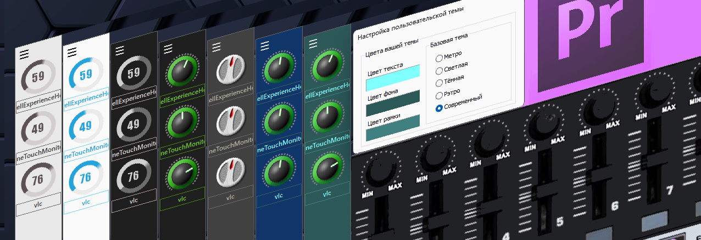

# MIDI EasyControl 9 - Mackie translator for Adobe Premiere Pro

MIDI-MT x64/x86 (Windows >=10) EasyControl-MIDI Command Translator to MIDI-Mackie for using Control Surface in Adobe Premiere Pro.  
Support any Control Surfaces as WORLDE, Pyle Audio PMIDIPD30, Fegoo manufacture and other.  

  

## EASYCONTROL 9 - usb midi controller features

- 9 assignable control knobs.  
- 9 assignable control sliders.  
- ~~11 assignable buttons.~~ __19__ assignable buttons.
- ~~6 transport buttons assignable to controllers.~~ __All buttons__ is assignable to controllers.  
- +__ALL__ buttons have double functions! Quick and Long press.
- 4 banks for different settings.
- +__JOG__ rotary working.
- USB interface, adaptable to USB 2.0 - FULL SPEED. Power suppliedby USB.  
- Compatible with Win7/XP/Vista/10/11 and Mac OS X. Drive free and hot-plug supported.  
- Edited by the WORLDE software Editor.  

## About dependencies

The application uses the MIDI driver Tobias Erichsen v1.3.0.43 dated 2019-12-02, to install the drivers visit the site,  
and install [loopmidi](https://www.tobias-erichsen.de/software/loopmidi.html) or [rtpmidi](https://www.tobias-erichsen.de/software/rtpmidi.html)  
These distributions include the drivers necessary for operation.  
The loopMIDI application itself is useful, allowing you to experiment with connecting and switching MIDI equipment.  
More details about MIDI-MT settings are described in the [wiki](https://github.com/ClaudiaCoord/MIDI-EasyControl-to-Mackie-translator-for-Premiere-Pro/wiki)  

## License MIT

- NOT FOR CHINESE USE FOR SALES! FREE SOFTWARE!  
- [License PDF](https://claudiacoord.github.io/MIDI-EasyControl-to-Mackie-translator-for-Premiere-Pro/docs/LicenseRu.pdf)  
