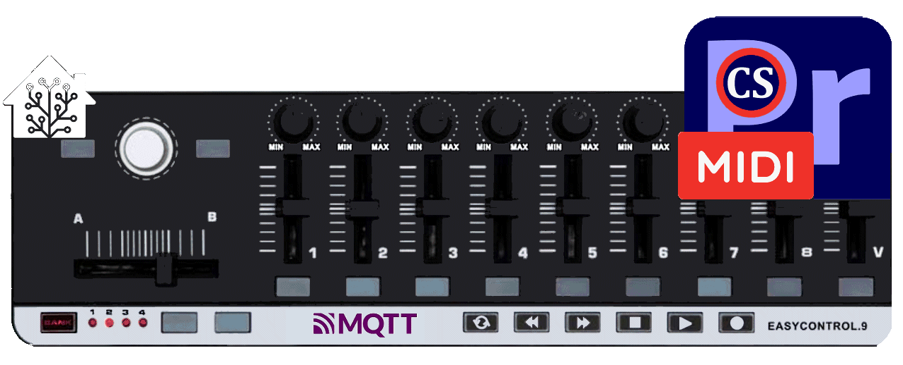

# MIDI EasyControl 9 - MIDI-MT is High Level Application Driver for USB MIDI Control Surface

MIDI-MT supports any control panels that work with a standard MIDI port of the device.
For example, such as __WORDLE__, __Pyle Audio PMIDIPD30__, __LAUDIO__, __KORG__, produced by __FEGOO__ and other compatible __USB MIDI__ Control Surface.  

Compatible `x64/x86` `Windows 10/11`.  

  

# MIDI-MT features

#### Translator to MIDI-Mackie protocol for working in Adobe Premiere Pro, After Effects and Photoshop

  

Using a MIDI keyboard in «Adobe Premiere Pro», translator of __EasyControl-MIDI__ commands into __MIDI-Mackie__ notation for using the __MIDI Control Surface__.  

You can connect your MIDI keyboard to «Adobe Premiere Pro» or «After Effects», «Photoshop».
Setting up «Premiere Pro» is as simple as selecting a __MIDI__ controller from the __Control Surface__ submenu in the __Setup__ menu.
All you have to do is assign actions to the functions assigned to the controller buttons.  

Adaptation to «Adobe» products boils down to converting MIDI notations of the __EasyControl9__ control panel into __MIDI-Mackie__ for working in «Adobe Premiere Pro». It may work across «Adobe's» entire line of products as long as they use the same MIDI notations in their products.  
Flexible settings, all controls work, unlike analogues.  
All buttons can be assigned dual functions! A quick press or a long press will perform different commands depending on the settings.  
The __JOG control__ works - frame-by-frame movement in the timeline.  

The connection process and setup is described in detail in the [wiki](https://github.com/ClaudiaCoord/MIDI-EasyControl-to-Mackie-translator-for-Premiere-Pro/wiki/EN-Settings-Premiere-Pro).  

#### Work simultaneously in Premiere Pro, After Effects and Photoshop

  

You can select the number of __MIDI Mackie__ output ports. Maximum value: `3` output ports. This feature will allow you to simultaneously control «Premiere Pro», «After Effects» and «Photoshop» programs from one __MIDI Control Surface__. It is possible to control other software that supports the __MIDI Mackie__ protocol.

#### Use MIDI-MT as a MIDI proxy HUB/server

  

Can be used __MIDI-MT__ as a __MIDI PROXY__ server. The number of proxy ports can be selected from `1` to `16`. This mode can be used to share one __MIDI input device__ between multiple applications. At the same time, the number of input ports is limited only by the number of connected __MIDI devices__.  

Working in `MIDI HUB` mode.  
You can create a "common port" that will receive commands from __all MIDI devices__ you have connected. Now any software that is connected to the __MIDI proxy output__ ports will receive commands sent from any connected MIDI controller.  

#### Use MIDI-MT as a Mixer of audio sessions of running applications

  

Advanced applications Audio Session Management:  
You can control audio sessions of running applications from a __MIDI Control Surface__, or from the built-in Audio panel.

It is especially important to use the [built-in audio mixer](https://github.com/ClaudiaCoord/MIDI-EasyControl-to-Mackie-translator-for-Premiere-Pro/wiki/EN-Mixer) to control sound in __Windows 11__, where the usual sound controls have been removed, and access to existing ones involves a long journey through the settings menu.

Control can occur either from a __MIDI Control Surface__, or from the built-in sound control panel. To control audio sessions from a __MIDI Control Surface__, there is no need to call up the Audio Panel. The panel is only needed to configure audio using the mouse, or to visualize the status of current audio sessions.

#### Use MIDI-MT as controlling multimedia keys from a MIDI Control Surface

  

Added an interface for controlling multimedia keys in `Windows 10/11` from a __MIDI Control Surface__.  

#### Use MIDI-MT as a Smart Home Control

  

Management of “smart devices” using the __MQTT protocol__.  You can integrate a __MIDI Control Surface__ into your smart home system to control various devices.  
Any “Smart Home control” environment based on the __MQTT__ exchange protocol and including an __MQTT__ server is supported.  

In the “[Smart Home system](https://github.com/ClaudiaCoord/MIDI-EasyControl-to-Mackie-translator-for-Premiere-Pro/wiki/EN-Smart-House)”, the __MQTT__ protocol must be at least level `5.0`,
You can work with earlier versions, but stability and full functionality for all commands is not guaranteed.

#### Use MIDI-MT as a Lighting control via DMX512 and ArtNet protocols

  

Currently, at reasonable prices, a large number of lighting equipment that support control via the __DMX512__ protocol has become available.  

The __DMX512__ protocol is designed to control lighting fixtures. It allows you to control `512` channels simultaneously via one three-wire communication line. Depending on the capabilities of the lighting device, you can change the color, brightness, position of the light beam, switch effects and many other characteristics. As a rule, several channels are used on one lighting fixture. Several devices switched on simultaneously allow using the __DMX512__ control protocol to create light patterns and design elements of varying complexity.

The __ArtNet__ protocol is a network version of the __DMX512__ protocol. Distributed over a local network by sending to broadcast addresses. In this case, the end equipment must support the __ArtNet__ protocol, or a gate must be installed to convert __ArtNet__ network packets to the __DMX512__ protocol.

__MIDI-MT__ supports [both](https://github.com/ClaudiaCoord/MIDI-EasyControl-to-Mackie-translator-for-Premiere-Pro/wiki/EN-Lighting-control) of these protocols, both simultaneous and separate operation is possible.

## EASYCONTROL 9 - USB MIDI Control Surface features:

  

- 9 assignable control knobs.  
- 9 assignable control sliders.  
- ~~11 assignable buttons.~~ __19__ assignable buttons.
- ~~6 transport buttons assignable to controllers.~~ __All buttons__ is assignable to controllers.  
- +__ALL__ buttons have double functions! Quick and Long press.
- 4 banks for different settings.
- +__JOG__ rotary working.
- USB interface, adaptable to USB 2.0 - FULL SPEED. Power suppliedby USB.  
- Compatible with Win7/XP/Vista/10/11 and Mac OS X. Drive free and hot-plug supported.  
- Edited by the WORLDE software Editor.  

## About dependencies

The application uses the MIDI driver Tobias Erichsen v1.3.0.43 dated 2019-12-02, to install the drivers visit the site,  
and install [loopmidi](https://www.tobias-erichsen.de/software/loopmidi.html) or [rtpmidi](https://www.tobias-erichsen.de/software/rtpmidi.html)  
These distributions include the drivers necessary for operation.  
The loopMIDI application itself is useful, allowing you to experiment with connecting and switching MIDI equipment.  
More details about MIDI-MT settings are described in the __wiki__ [EN](https://github.com/ClaudiaCoord/MIDI-EasyControl-to-Mackie-translator-for-Premiere-Pro/wiki/EN) | [RU](https://github.com/ClaudiaCoord/MIDI-EasyControl-to-Mackie-translator-for-Premiere-Pro/wiki/RU)  

## License MIT

- FREE SOFTWARE!  
- [License PDF](https://claudiacoord.github.io/MIDI-EasyControl-to-Mackie-translator-for-Premiere-Pro/LicenseRu.pdf)  
